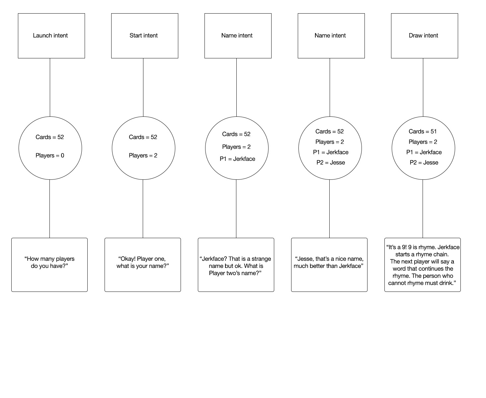

# Alexa Kings Cup Skill

## Background and Overview
  The development of Alexa skills, and the use of Amazon Web Services is an emerging skill set which many employers seek. In addition to being a desired, and employable skill there is a large lack of quality interactive group games within the Alexa skills shop. A demand exist for quality entertainment with what is becoming a household item.

## Functionality and MVP
  - Users can initiate the skill with a wake word
  - The game will keep track of the cards for each session
  - Rules will be associated with each card
  - At any time users can ask for further clarification for a card rule.
  - Skill will keep track of which players turn it is.
  - Game will be published on the alexa skills marketplace.
  ### Bonus Features
  - Additional games such as
    - Power Hour
    - Dice

## Technologies
  - Node.js
  - JavaScript
  - AWS
  - SSML
  - CSS
  - HTML

## Technological Challenges
  Although an Alexa skill is largely written in JavaScript the entire syntax is very unusual and different. Members of the team will have to familiarize themselves with this new skillset, and become familiar with node.js

  Amazon will host an Alexa skill on their cloud if it set up on Amazon Web Services, which is an unfamiliar program. Although learning amazon web services is the largest value of this project as it is an employable skill.

  Effectively demoing the Alexa skill is going to be a difficult challenge.

## Accomplished over the weekend
  - All members of the team have gone through a tutorial in the construction of an Alexa skill
  - All members have set up Amazon developer accounts.
  - All members have begun reading documentation on Node.js, and working through tutorials

## Group Members & Work Breakdown

 ### Day 1
  - Construct intent schema
  - Finalize VUI
  - Seed database with audio samples for game usage
  - Ensure all team members were successful in their AWS set up over the weekend
 ### Day 2
  - Begin node setup - Alex
  - Begin demo page setup - Rachel
  - Construct game logic - Jesse
 ### Day 3
  - Complete game logic, and have a playable game from alexa-app-server using JSON - Jesse
  - Verify schedule for the rest of the week
  - Work on Amazon Lambda Function for hosting of skill - Rachel
  - Ensure Node.js server is compatible with
   amazon lambda function hosting - Alex
  - All members will thoroughly test the program and create command phrases the ensure robust skill.
  ### Day 5
  - Complete hosting of skill on Amazon skill store - Alex
  - Begin work on demo of skill - Jesse
  - Finalize demo page - Rachel
  - Thoroughly test the skill to predict possible user inputs.
  ### Day 6
  - Finalize any remaining outstanding issues
  - Find other users to test the game, and get their feedback.

## Plan for getting users and reviews
  Users will be acquired largely through word of mouth through the App Academy network. The game will also be spread throughout social media, and friends and family will be encouraged to try the game and review it on the Amazon skill store.

## VUI
Below is a rough VUI (voice user interface) diagram

